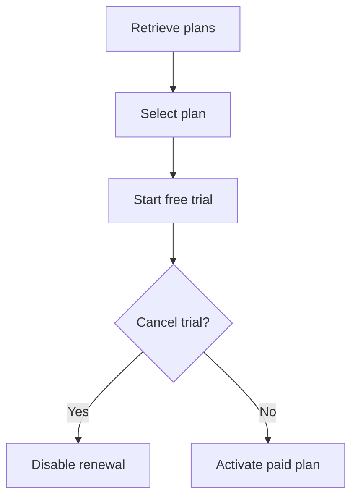

# subscription-testing-qa-portfolio
# Subscription Testing QA Portfolio

A complete QA portfolio project demonstrating manual testing, API
testing, Cypress automation, security validation, bug reporting and
CI/CD for a subscription-based application.

## Project Objective

The objective is to validate a subscription lifecycle covering:

- Annual and monthly subscription plans
- Promotional pricing
- Seven-day free trial
- Subscription creation
- Duplicate-request protection
- Subscription retrieval
- Cancellation
- Authentication
- Authorization
- IDOR/BOLA protection

## Important Disclosure

The REST API included in this repository was developed locally for
portfolio and testing purposes.

It does not represent, reproduce or access the private API of any
existing company or production application.

## Application Flow



## Subscription Plans

| Plan | Promotional price | Billing amount | Trial |
|---|---:|---:|---:|
| Annual | AED 33.33/month | AED 399.99/year | 7 days |
| Monthly | AED 64.99/month | AED 64.99/month | 7 days |

## Skills Demonstrated

- Requirements analysis
- Risk-based test planning
- Manual Gherkin/BDD scenarios
- REST API creation using Express
- Postman collection testing
- Cypress API automation
- Positive and negative testing
- Authentication testing
- IDOR/BOLA authorization testing
- Idempotency testing
- Bug reporting
- Requirements traceability
- GitHub Actions CI/CD

## Tools and Technologies

| Tool | Purpose |
|---|---|
| Cypress 16 | API automation |
| JavaScript | Test and API implementation |
| Node.js | Runtime |
| Express | Local mock REST API |
| Postman | Manual API testing |
| Git | Version control |
| GitHub | Source-code hosting |
| GitHub Actions | CI/CD |

## Project Structure

```text
subscription-testing-qa-portfolio/
├── api-testing/
├── bug-reports/
├── cypress/e2e/api/
├── docs/
├── manual-testing/
├── mock-api/
├── reports/
├── .github/workflows/
├── cypress.config.js
├── package.json
└── README.md
```

## Mock API Endpoints

| Method | Endpoint | Purpose |
|---|---|---|
| GET | `/health` | Check API availability |
| GET | `/api/subscription-plans` | Retrieve plans |
| POST | `/api/subscriptions` | Create a trial |
| GET | `/api/subscriptions/:id` | Retrieve subscription |
| POST | `/api/subscriptions/:id/cancel` | Cancel subscription |

## Test Coverage

### Manual Testing

- Plan presentation
- Annual and monthly plan selection
- Promotional messaging
- Price calculations
- Trial information
- Cancellation
- Refund messaging
- Legal links
- Mobile safe area
- Accessibility observations

### API Testing

- API health
- Plan retrieval
- Required plan fields
- Annual pricing
- Monthly pricing
- Trial creation
- Invalid plan
- Missing authentication
- Missing idempotency key
- Subscription retrieval
- Cancellation
- Unknown endpoint

### Security Testing

- Authentication validation
- Cross-user subscription access
- IDOR/BOLA protection
- Cross-user cancellation
- Sensitive-data exposure
- Client-side price manipulation
- Duplicate-request protection

## Installation

### Prerequisites

Install:

- Node.js
- npm
- Git
- Google Chrome
- Postman

### Clone the repository

```bash
git clone https://github.com/gayathri89-demo/subscription-testing-qa-portfolio.git
cd subscription-testing-qa-portfolio
```

### Install dependencies

```bash
npm install
```

## Execution

### Start the mock API

```bash
npm run api:start
```

Health URL:

```text
http://127.0.0.1:3000/health
```

Plans URL:

```text
http://127.0.0.1:3000/api/subscription-plans
```

### Run all Cypress API tests

```bash
npm run test:api
```

This command:

1. Starts the mock API.
2. Waits for the health endpoint.
3. Executes the Cypress API suite in Chrome.
4. Stops the API after execution.

### Open Cypress

```bash
npm run cy:open
```

## Postman Execution

1. Start the mock API with `npm run api:start`.
2. Open Postman.
3. Import `Subscription-API.postman_collection.json`.
4. Import `Local.postman_environment.json`.
5. Select the local environment.
6. Run the collection.

## CI/CD

GitHub Actions runs the Cypress API tests when:

- Code is pushed to `main`.
- A pull request targets `main`.
- The workflow is started manually.

Test evidence is uploaded when available.

## Key Findings

### Monthly Discount Mismatch

The monthly price changes from AED 99.99 to AED 64.99.

```text
(99.99 - 64.99) / 99.99 × 100 = approximately 35%
```

This does not exactly match the advertised 33% discount.

### Mobile Safe-Area Issue

Header content overlaps the mobile status bar.

### Unclear Trial Charge

The CTA does not clearly repeat the charge and billing date after the
seven-day trial.

Detailed reports are available in the `bug-reports` folder.

## Documentation

- [Requirements Analysis](docs/requirements-analysis.md)
- [Test Plan](docs/test-plan.md)
- [Test Strategy](docs/test-strategy.md)
- [Traceability Matrix](docs/traceability-matrix.md)
- [API Test Scenarios](api-testing/api-test-scenarios.md)

## Current Limitations

- The API stores data in memory.
- Restarting the API clears its data.
- Authentication is simulated using `x-user-id`.
- No real payment gateway is connected.
- Trial expiry and refund processing are not automated.
- The project does not use production endpoints.

## Future Improvements

- Replace simulated authentication with JWT.
- Add JSON schema validation.
- Add automated trial-expiry processing.
- Add payment-webhook simulation.
- Add refund endpoints and tests.
- Add a database.
- Add API performance testing.
- Add Newman execution to GitHub Actions.

## Author

Gayathri Ramachandran Nair  
Senior QA Engineer / Squad Lead  
Dubai, UAE