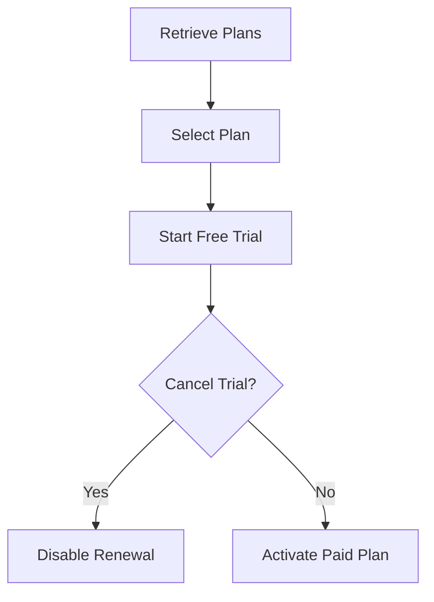

# Subscription Testing QA Portfolio

[](https://github.com/gayathri89-demo/subscription-testing-qa-portfolio/actions/workflows/api-tests.yml)

A complete QA portfolio project demonstrating manual testing, API testing, Cypress automation, security validation, bug reporting and CI/CD for a subscription-based application.

## Project Objective

The objective is to validate a subscription lifecycle covering:

- Annual and monthly subscription plans
- Promotional pricing
- Seven-day free trials
- Subscription creation
- Duplicate-request protection
- Subscription retrieval
- Cancellation
- Authentication
- Authorization
- IDOR/BOLA protection
- Client-side price manipulation

## Important Disclosure

The REST API included in this repository was developed locally for portfolio and testing purposes.

It does not represent, reproduce or access the private API of any existing company or production application.

## Application Flow



## Subscription Plans

| Plan | Promotional Price | Billing Amount | Trial |
|---|---:|---:|---:|
| Annual | AED 33.33/month | AED 399.99/year | 7 days |
| Monthly | AED 64.99/month | AED 64.99/month | 7 days |

## Skills Demonstrated

- Requirements analysis
- Risk-based test planning
- Manual Gherkin/BDD scenarios
- REST API creation using Express
- API testing using Postman
- Cypress API automation
- Positive and negative testing
- Authentication testing
- Authorization testing
- IDOR/BOLA security testing
- Idempotency testing
- Client-side price-manipulation testing
- Bug reporting
- Requirements traceability
- GitHub Actions CI/CD

## Tools and Technologies

| Tool | Purpose |
|---|---|
| Cypress 16 | API automation |
| JavaScript | Test and API implementation |
| Node.js | Runtime |
| Express | Local mock REST API |
| Postman | Manual API testing |
| Git | Version control |
| GitHub | Source-code hosting |
| GitHub Actions | CI/CD |

## Project Structure

```text
subscription-testing-qa-portfolio/
├── .github/
│   └── workflows/
│       └── api-tests.yml
├── api-testing/
│   ├── Subscription API QA Portfolio.postman_collection.json
│   ├── Local.postman_environment.json
│   └── api-test-scenarios.md
├── bug-reports/
│   └── BUG-001-monthly-discount-mismatch.md
├── cypress/
│   ├── e2e/
│   │   └── api/
│   │       ├── authorization-api.cy.js
│   │       ├── idempotency-api.cy.js
│   │       ├── plans-api.cy.js
│   │       └── subscription-api.cy.js
│   ├── fixtures/
│   └── support/
├── docs/
│   ├── requirements-analysis.md
│   ├── test-plan.md
│   ├── test-strategy.md
│   └── traceability-matrix.md
├── manual-testing/
│   ├── pricing-validation.feature
│   ├── subscription-plan.feature
│   └── trial-and-cancellation.feature
├── mock-api/
│   └── server.js
├── .gitignore
├── cypress.config.js
├── package-lock.json
├── package.json
└── README.md
```

## Mock API Endpoints

| Method | Endpoint | Purpose |
|---|---|---|
| GET | `/health` | Check API availability |
| GET | `/api/subscription-plans` | Retrieve plans |
| POST | `/api/subscriptions` | Create a trial |
| GET | `/api/subscriptions/:id` | Retrieve a subscription |
| POST | `/api/subscriptions/:id/cancel` | Cancel a subscription |

## Test Coverage

### Manual Testing

- Subscription-plan presentation
- Annual and monthly plan selection
- Promotional messaging
- Price calculations
- Trial information
- Cancellation
- Refund messaging
- Legal links
- Mobile safe-area review
- Accessibility observations

### API Testing

- API health
- Plan retrieval
- Required plan fields
- Annual pricing
- Monthly pricing
- Annual and monthly trial creation
- Exact seven-day trial duration
- Invalid-plan validation
- Missing authentication
- Missing idempotency key
- Subscription retrieval
- Subscription cancellation
- Unknown subscription
- Unknown endpoint
- Repeated cancellation
- Resubscription after cancellation

### Security Testing

- Authentication validation
- Cross-user subscription access
- IDOR/BOLA protection
- Cross-user cancellation
- Sensitive-data exposure
- Client-side price manipulation
- Duplicate-request protection
- State validation after unauthorized requests

### Idempotency Testing

- Same request and key return the same subscription
- Missing idempotency key is rejected
- A second active subscription is prevented
- A cancelled user can create a new subscription

## Installation

### Prerequisites

Install:

- Node.js
- npm
- Git
- Google Chrome
- Postman

### Clone the Repository

```bash
git clone https://github.com/gayathri89-demo/subscription-testing-qa-portfolio.git
cd subscription-testing-qa-portfolio
```

### Install Dependencies

```bash
npm ci
```

If `package-lock.json` is unavailable, use:

```bash
npm install
```

## Execution

### Start the Mock API

```bash
npm run api:start
```

Health URL:

```text
http://127.0.0.1:3000/health
```

Expected response:

```json
{
  "status": "UP"
}
```

Plans URL:

```text
http://127.0.0.1:3000/api/subscription-plans
```

### Run All Cypress API Tests

```bash
npm run test:api
```

This command:

1. Starts the mock API.
2. Waits for the health endpoint.
3. Executes the Cypress API suite.
4. Stops the API after execution.

### Run a Single Cypress Test File

Authorization tests:

```bash
npx start-server-and-test api:start http://127.0.0.1:3000/health "cypress run --spec cypress/e2e/api/authorization-api.cy.js"
```

Subscription tests:

```bash
npx start-server-and-test api:start http://127.0.0.1:3000/health "cypress run --spec cypress/e2e/api/subscription-api.cy.js"
```

Idempotency tests:

```bash
npx start-server-and-test api:start http://127.0.0.1:3000/health "cypress run --spec cypress/e2e/api/idempotency-api.cy.js"
```

Plan tests:

```bash
npx start-server-and-test api:start http://127.0.0.1:3000/health "cypress run --spec cypress/e2e/api/plans-api.cy.js"
```

### Open Cypress

Start the mock API in one terminal:

```bash
npm run api:start
```

Open a second terminal:

```bash
npm run cy:open
```

Select **E2E Testing** and choose the required API test file.

## Postman Execution

1. Start the mock API:

```bash
npm run api:start
```

2. Open Postman.

3. Import the collection:

```text
api-testing/Subscription API QA Portfolio.postman_collection.json
```

4. Import the environment:

```text
api-testing/Local.postman_environment.json
```

5. Select `Subscription API - Local`.

6. Run the requests in the following order:

   1. Health Check
   2. Retrieve Subscription Plans
   3. Create Annual Trial
   4. Retrieve Owned Subscription
   5. Prevent Cross-User Retrieval
   6. Prevent Cross-User Cancellation
   7. Cancel Owned Subscription
   8. Negative test requests

The creation request stores the generated subscription ID for the following requests.

## CI/CD

GitHub Actions runs the Cypress API tests when:

- Code is pushed to `main`
- A pull request targets `main`
- The workflow is started manually

The workflow:

1. Checks out the repository.
2. Installs Node.js.
3. Installs dependencies using `npm ci`.
4. Starts the mock API.
5. Executes the Cypress tests.
6. Uploads available screenshots and videos.

Workflow file:

```text
.github/workflows/api-tests.yml
```

## Confirmed Finding

### BUG-001: Monthly Discount Mismatch

The promotional banner advertises a 33% discount, but the monthly price changes from AED 99.99 to AED 64.99.

```text
(99.99 - 64.99) / 99.99 × 100
= approximately 35%
```

The displayed monthly promotional price does not exactly match the advertised discount.

Detailed bug report:

```text
bug-reports/BUG-001-monthly-discount-mismatch.md
```

## Documentation

- [Requirements Analysis](docs/requirements-analysis.md)
- [Test Plan](docs/test-plan.md)
- [Test Strategy](docs/test-strategy.md)
- [Traceability Matrix](docs/traceability-matrix.md)
- [API Test Scenarios](api-testing/api-test-scenarios.md)
- [BUG-001 Report](bug-reports/BUG-001-monthly-discount-mismatch.md)

## Current Limitations

- The API stores data in memory.
- Restarting the API clears its data.
- Authentication is simulated using the `x-user-id` header.
- No real payment gateway is connected.
- Trial expiry is not processed automatically.
- Refund processing is not implemented.
- The project does not use production endpoints or customer data.

## Future Improvements

- Replace simulated authentication with JWT.
- Add JSON schema validation.
- Add automated trial-expiry processing.
- Add payment-webhook simulation.
- Add refund endpoints and tests.
- Add persistent database validation.
- Add API performance testing.
- Add Newman execution to GitHub Actions.

## Author

Gayathri Ramachandran Nair  
Senior QA Engineer / Squad Lead  
Dubai, UAE